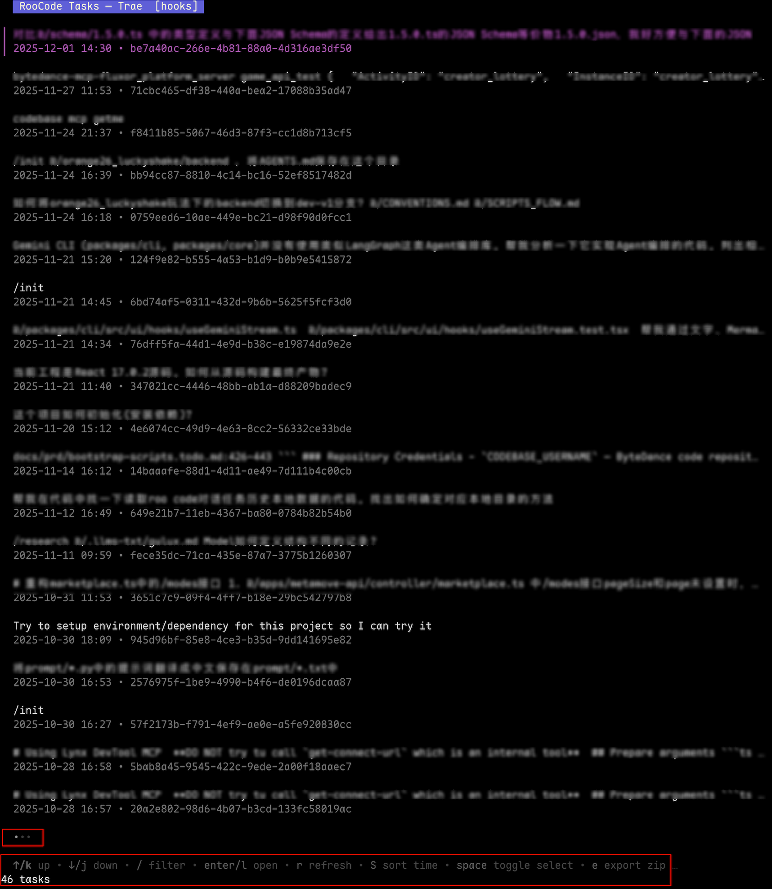
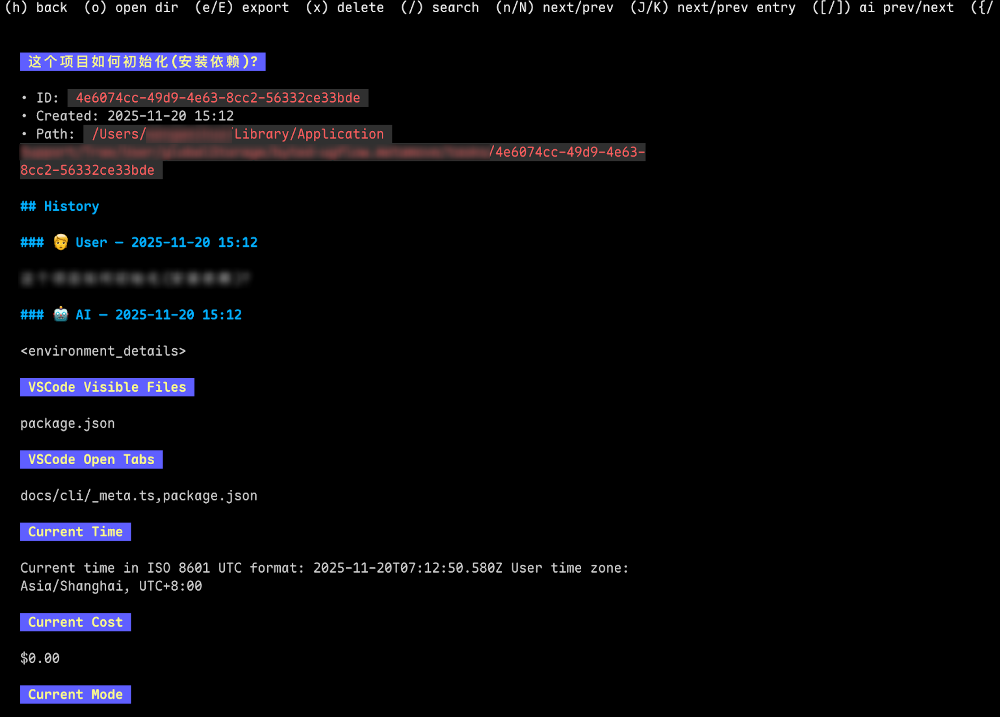

# RooCode Task Manager (CLI + TUI)

Terminal TUI for browsing, exporting, importing, and deleting RooCode tasks created by the VS Code extension `RooVeterinaryInc.roo-cline` (and forks).





- Built with Go + Charmbracelet Bubble Tea
- Vim keys: j/k/g/G, Enter/l open, h back, q quit, r refresh, e export, x delete

## Getting Started

- Requirements: Go 1.23+
- Install deps and build:

```
# Using Makefile (builds with JS hooks by default)
make build

# Or manual build
go get github.com/dop251/goja@latest
go build -tags js_hooks -o roo-task-man ./cmd/roo-task-man

# Run
./roo-task-man

# Print version
./roo-task-man --version

# Build release archives for macOS (arm64/amd64) and Windows (amd64)
make release
ls dist/

# Update VERSION file from git tags before release
make version-update
```

Flags:

- `--plugin-id <id>` (default `RooVeterinaryInc.roo-cline`)
- `--code-channel <Editor>` or `--editor <Editor>` where `<Editor>` can be:
  - `Code` (default), `Insiders`, `VSCodium`, `Cursor`, `Windsurf`, `Trae`, `Custom`, or the exact app dir name (e.g. `MyCodeFork`)
  - On macOS this maps to `~/Library/Application Support/<Editor>/User/globalStorage/<pluginId>`
  - On Linux to `~/.config/<Editor>/User/globalStorage/<pluginId>`
  - On Windows to `%APPDATA%/<Editor>/User/globalStorage/<pluginId>`
  - For `Custom`, provide `--data-dir` to point directly to the globalStorage root
- `--data-dir <path>` override VS Code globalStorage root
- `--config <path>` config file (default `~/.config/roo-code-man.json`)
- `--export <task-id>:<zip>` batch export then exit
- `--import <zip>` batch import then exit
- `--inspect <zip>` inspect a zip by extracting to a temp dir and opening the TUI on it
- `--export-dir <path>` default directory for TUI exports
- `--debug` print debug info (storage root, task paths) and show full paths in list descriptions

Default export location
- By default, exports are saved to the current working directory.
- Configure a different default:
  - CLI: `--export-dir /path/to/exports`
  - Config file: set `"exportDir": "/path/to/exports"` in `~/.config/roo-code-man.json`.
  - The app prints the absolute path to the created zip and opens the export folder.

## How to Use

- List view
  - Sort by created time: `S` toggles asc/desc (default: latest first)
  - Filter: just type; searches title + UID + created time + description
    - Explicit filters supported (strict pre-filter): include `-uid=<part>` and/or `-d=<part-of-created-time>` in your query; only matching tasks are shown, then further fuzzy filtering applies within those
  - Toggle selection while filtering: use `Tab` (Space also works when not typing)
  - Selection: `Tab`/`Space` toggle, `C` clear; `e` export current, `E` export selected
  - Open detail: `Enter`/`l` | Refresh: `r` | Help: `?` | Quit: `q`
  - Page: PgDown/Ctrl+f/Ctrl+d, PgUp/Ctrl+b/Ctrl+u
  - Open task folder: `o`

- Detail view
  - Scroll: `j/k`, `PgDown/Ctrl+f`, `PgUp/Ctrl+b`, `Ctrl+d/u`, `gg`, `G`
  - Search: `/`, then `Enter` to highlight; `n/N` next/prev match
  - Navigate history entries: `J/K` next/prev entry
  - Jump by role: `]`/`[` next/prev AI, `}`/`{` next/prev User
  - Actions: `o` open task dir, `e/E` export, `x` delete, `h/q` back

## Development

- Go 1.23+ is required.
- Building:
  - Without hooks: `go build -o roo-task-man ./cmd/roo-task-man`
  - With hooks: `go get github.com/dop251/goja@latest && go build -tags js_hooks -o roo-task-man ./cmd/roo-task-man`
- Running against example data and hooks:
  - `./roo-task-man --data-dir ./task-example --hooks-dir ./hooks/custom --debug`
- Tests:
  - `go test ./...`

## Config

`~/.config/roo-code-man.json` example:

```
{
  "pluginId": "RooVeterinaryInc.roo-cline",
  "codeChannel": "Code",
  "dataDir": "",
  "hooksDir": "~/.config/roo-code-man/hooks"
}
```

## Hooks (JavaScript)

Place `.js` files in `hooksDir`. See `docs/hooks.d.ts` for available hook signatures.

Important: Build with JS hooks enabled
- The JS runtime is optional and behind a build tag. To enable hooks:
  - `go get github.com/dop251/goja@latest`
  - `go build -tags js_hooks -o roo-task-man ./cmd/roo-task-man`
  - Run with your hooks: `./roo-task-man --hooks-dir ./hooks/custom`

Customize task list items
```
// hooks/custom/index.js
export function renderTaskListItem(task) {
  const title = '===' + (task.title || task.summary || task.id) + '===';
  const desc = `${new Date(task.createdAt).toLocaleString()} • ${task.id}`;
  return { title, desc };
}
```
You should see the title surrounded with `===` in the list. If not, confirm you built with `-tags js_hooks` and passed `--hooks-dir`. The engine strips `export` keywords automatically for compatibility with plain scripts.

Debugging hooks
- Run with `--debug` to see loader and call logs, e.g.:
  - `[hooks] loaded hooks/custom/index.js`
  - `[hooks] function available: renderTaskListItem`
  - `[hooks] calling renderTaskListItem for <id> input={...}`
  - `[hooks] renderTaskListItem returned: {...}`

Customize task list items with hooks

You can customize how each list item renders (title/second-line) by exporting `renderTaskListItem`:

```
// hooks/custom/index.js
export function renderTaskListItem(task) {
  // task has id, title, summary, createdAt (ISO), path, meta
  const title = task.title || task.summary || task.id
  const desc = `${new Date(task.createdAt).toLocaleString()} • ${task.id}`
  return { title, desc }
}
```

Run with: `./roo-task-man --hooks-dir ./hooks/custom` (build with `-tags js_hooks`).

## Notes

- Task discovery uses VS Code `globalStorage` for the configured plugin ID. Folders under `<root>/tasks/*` are treated as tasks if they contain files. This can be customized via hooks.
- Export creates `<id>.zip` with a simple manifest; import restores into the storage root.
- The list view title shows the selected editor (e.g., `Cursor`) and each item shows `UUID — created` on the first line with the initial prompt summary under it. When `--debug` is set, the task's full path is appended in the description.
