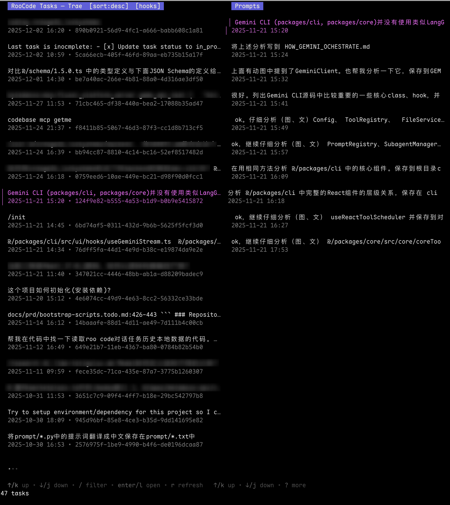

# RooCode Task Manager (CLI + TUI)

Terminal TUI for browsing, exporting, importing, and deleting RooCode tasks created by the VS Code extension `RooVeterinaryInc.roo-cline` (and forks).




- Built with Go + Charmbracelet Bubble Tea
- Two‑panel list: left Tasks, right Prompts (human prompts of selected task)
- Filter matches title/ID/created AND user prompts; selection updates Prompts panel
- Vim keys: j/k/g/G, Enter/l open, h back, q quit, r refresh, e export, x delete

See CHANGELOG.md for release notes (latest: v0.1.1).

## Getting Started

- Requirements: Go 1.23+
- Install deps and build:

```
# Using Makefile
make build

# Or manual build
go build -o roo-task-man ./cmd/roo-task-man

# Run
./roo-task-man

# Print version
./roo-task-man --version

# Build release archives for macOS (arm64/amd64), Linux (amd64/arm64), and Windows (amd64)
make release
ls dist/

Notes:
- Linux cross-builds are CGO-free to avoid host toolchain issues (CGO_ENABLED=0).

# Update VERSION file from git tags before release
make version-update
```

Flags:

- `--plugin-id <id>` (default `RooVeterinaryInc.roo-cline`)
- `--code-channel <Editor>` or `--editor <Editor>` where `<Editor>` can be:
  - `Code` (default), `Insiders`, `VSCodium`, `Cursor`, `Windsurf`, `Trae`, `Custom`, or the exact app dir name (e.g. `MyCodeFork`)
  - On macOS this maps to `~/Library/Application Support/<Editor>/User/globalStorage/<pluginId>`
  - On Linux to `~/.config/<Editor>/User/globalStorage/<pluginId>`
  - On Windows to `%APPDATA%/<Editor>/User/globalStorage/<pluginId>`
  - For `Custom`, provide `--data-dir` to point directly to the globalStorage root
- `--data-dir <path>` override VS Code globalStorage root
- `--config <path>` config file (default `~/.config/roo-code-man.json`)
- `--export <task-id>:<zip>` batch export (single task) then exit
- `--export <zip>` with filters below to export multiple tasks:
  - `--taskids=<id1>,<id2>,...` select by task UIDs
  - `--date-range=from..to` select by created-at date (YYYY-MM-DD or YYYYMMDD, inclusive)
- `--import <zip>` batch import (single or multi archive) then exit
- `--workspace <path>` when combined with `--import`, also registers the imported tasks into the editor's global state DB so they appear in the extension history for that workspace
- `--restore` interactive restore of `state.vscdb` from backups (lists `state.vscdb.bak-*`, restore both primary and paired `state.vscdb.backup`)
- `--inspect <zip>` inspect a zip by extracting to a temp dir and opening the TUI on it
- `--export-dir <path>` default directory for TUI exports
- `--dump <file.md>` dump all tasks and human prompts to Markdown with a single‑line progress indicator
- `--debug` print debug info (storage root, task paths) and show full paths in list descriptions

Default export location
- By default, exports are saved to the current working directory.
- Configure a different default:
  - CLI: `--export-dir /path/to/exports`
  - Config file: set `"exportDir": "/path/to/exports"` in `~/.config/roo-code-man.json`.
  - The app prints the absolute path to the created zip and opens the export folder.

## How to Use

- List view
  - Sort by created time: `S` toggles asc/desc (default: latest first)
  - Filter: just type; searches title + UID + created time + user prompts corpus
    - Explicit tokens (pre-filter): `-uid=<part>`, `-d=<date>`; also supports `-d>=YYYY-MM-DD`, `-d<=YYYY-MM-DD`, and `-d:YYYY-MM` month match
    - While filtering, one-key item shortcuts are disabled to avoid accidental actions; press Esc to clear filter then use shortcuts
  - Toggle selection while filtering: use `Tab` (Space also works in most terminals)
  - Selection: `Tab`/`Space` toggle, `C` clear; `e` export current, `E` export selected
  - Open detail: `Enter`/`l` | Refresh: `r` | Help: `?` | Quit: `q`
  - Page: PgDown/Ctrl+f/Ctrl+d, PgUp/Ctrl+b/Ctrl+u
  - Open task folder: `o`

- Detail view
  - Scroll: `j/k`, `PgDown/Ctrl+f`, `PgUp/Ctrl+b`, `Ctrl+d/u`, `gg`, `G`
  - Search: `/`, then `Enter` to highlight; `n/N` next/prev match
  - Navigate history entries: `J/K` next/prev entry
  - Jump by role: `]`/`[` next/prev AI, `}`/`{` next/prev User
  - Actions: `o` open task dir, `e/E` export, `x` delete, `h/q` back

### CLI-Only Export Examples

- Single task:
  - `./roo-task-man --editor Code --export <task-id>:/tmp/task.zip`
- Multiple by IDs:
  - `./roo-task-man --editor Code --export /tmp/tasks.zip --taskids id1,id2,id3`
- By date range (inclusive):
  - `./roo-task-man --editor Code --export /tmp/tasks.zip --date-range 2025-12-01..2025-12-02`
- Combine filters (union):
  - `./roo-task-man --editor Code --export /tmp/tasks.zip --taskids id1,id2 --date-range 20251201..20251202`

### Import + Register Into Editor History

> **Note**: ALWAYS Backup your editor state DBs before importing!
> MacOS: `~/Library/Application Support/<Editor>/User/globalStorage/state.vscdb{,.backup}`
> Linux: `~/.config/<Editor>/User/globalStorage/state.vscdb{,.backup}`
> Windows: `%APPDATA%/<Editor>/User/globalStorage/state.vscdb{,.backup}`


When importing, the tool also adds the imported tasks to the editor's recent task history. If `--workspace` is omitted, the current working directory is used.

- `./roo-task-man --editor Code --import /path/to/in.zip --workspace /path/to/workspace`
  or simply:
- `./roo-task-man --editor Code --import /path/to/in.zip` (uses current working directory)

### Default Export Filename (when --export omitted)

- If you pass `--taskids` without `--export`, the filename is derived automatically in the current directory:
  - Single ID: `<editor>-<plugin-id>-<full-id>.zip`
  - Multiple IDs: `<editor>-<plugin-id>-<A>_<B>_<C>.zip` where `<A>/<B>/<C>` are the first segments (before `-`) of each ID.

Behavior:
- Extracts tasks into the configured globalStorage root (same as TUI import).
- Opens the editor's global state DB (`state.vscdb`) and appends one entry per imported task under your `--plugin-id` key.
- Each entry includes: `id`, `number`, `ts` (created time), `task` (summary), `tokensIn`, `tokensOut`, `cacheReads`, `cacheWrites`, `totalCost`, `size`, `workspace`, and `mode` (set to `code`).

Notes:
- On macOS, the state DB is at `~/Library/Application Support/<Editor>/User/globalStorage/state.vscdb`.
- On Linux, at `~/.config/<Editor>/User/globalStorage/state.vscdb`.
- On Windows, at `%APPDATA%/<Editor>/User/globalStorage/state.vscdb`.
- A timestamped backup of the DB is created before mutation; if a `state.vscdb.backup` exists, it is updated as well.
- If a task directory already exists at the destination, import skips extracting that task (no duplicate "-copy" directories).

## Development

- Go 1.23+ is required.
- Building:
  - `go build -o roo-task-man ./cmd/roo-task-man`
- Running against example data and hooks:
  - `./roo-task-man --data-dir ./task-example --hooks-dir ./hooks/custom --debug`
- Tests:
  - `go test ./...`

## Config

`~/.config/roo-code-man.json` example:

```
{
  "pluginId": "RooVeterinaryInc.roo-cline",
  "codeChannel": "Code",
  "dataDir": "",
  "hooksDir": "~/.config/roo-code-man/hooks"
}
```

## Hooks (JavaScript)

Place `.js` files in `hooksDir`. See `docs/hooks.d.ts` for available hook signatures.

Hooks are enabled by default
- No special build tags are needed. Place `.js` files in your `--hooks-dir` and run with `--debug` to see hook loader/call logs.

Customize task list items
```
// hooks/custom/index.js
export function renderTaskListItem(task) {
  const title = '===' + (task.title || task.summary || task.id) + '===';
  const desc = `${new Date(task.createdAt).toLocaleString()} • ${task.id}`;
  return { title, desc };
}
```
You should see the title surrounded with `===` in the list. If not, confirm you passed `--hooks-dir`. The engine strips `export` keywords automatically for compatibility with plain scripts.

Debugging hooks
- Run with `--debug` to see loader and call logs, e.g.:
  - `[hooks] loaded hooks/custom/index.js`
  - `[hooks] function available: renderTaskListItem`
  - `[hooks] calling renderTaskListItem for <id> input={...}`
  - `[hooks] renderTaskListItem returned: {...}`

Customize task list items with hooks

You can customize how each list item renders (title/second-line) by exporting `renderTaskListItem`:

```
// hooks/custom/index.js
export function renderTaskListItem(task) {
  // task has id, title, summary, createdAt (ISO), path, meta
  const title = task.title || task.summary || task.id
  const desc = `${new Date(task.createdAt).toLocaleString()} • ${task.id}`
  return { title, desc }
}
```

Run with: `./roo-task-man --hooks-dir ./hooks/custom`.

## Notes

- Task discovery uses VS Code `globalStorage` for the configured plugin ID. Folders under `<root>/tasks/*` are treated as tasks if they contain files. This can be customized via hooks.
- Export creates `<id>.zip` with a simple manifest; import restores into the storage root.
- The list shows `title` as a single line (JSON and fenced code blocks removed; long text truncated). Right pane shows human prompts as one-liners with the same sanitization.
- `--dump` writes Markdown with these rules; if a title/prompt was cleaned or truncated, the full content is included below in a collapsible `<details>` block.
- The list view title shows the selected editor (e.g., `Cursor`). When `--debug` is set, the task's full path is appended in the description.
- Restore state DB from a backup interactively:
  - `./roo-task-man --editor Code --restore`
  - Use Up/Down or j/k to select a backup (sorted by time), press Enter to restore both `state.vscdb` and paired `state.vscdb.backup` (same suffix). Press `o` to open the folder if you prefer restoring manually.
